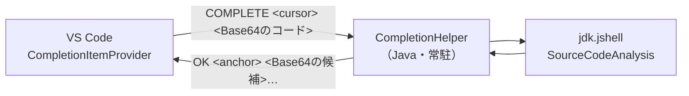

# プログラム設計書：入力補完（src/completion.ts、src/java/CompletionHelper.java）

## 1. 概要
Java コードの入力中に候補を表示する機能。`System.` と入力すると `out` や `err` が候補に出る。

同梱している JDK の **JShell 解析API（`jdk.jshell` の `SourceCodeAnalysis`）** を利用する。
これは JShell の Tab 補完と同じ仕組みで、外部の言語サーバーや別途の JDK は不要。

解析は Java のヘルパープロセスが担当し、VS Code 拡張機能とは標準入出力でやり取りする。
補完のたびに JVM を起動すると実用に耐えないため、**ヘルパーは常駐させる**。

## 2. 基本情報
| 項目 | 内容 |
|------|------|
| 実装ファイル | `src/completion.ts`（VS Code側）／`src/java/CompletionHelper.java`（Java側） |
| 配置 | ヘルパーのソースはビルド時に `dist/tools/CompletionHelper.java` へ複製する（`scripts/copy-tools.js`） |
| 実行方法 | 単一ファイルソースコードランチャー（`java CompletionHelper.java`）。事前コンパイル不要 |
| 有効化 | `activationEvents: ["onLanguage:java"]` |
| 設定 | `JavaCodeSelectionRunner.enable_completion`（既定 `true`） |

## 3. 構成

## 4. 通信プロトコル

1行1リクエスト・1行1レスポンスのテキストプロトコル。
改行や空白を含むコードを1行で安全に送るため、**コードと候補は Base64（UTF-8）で符号化**する。

| 要求 | 応答 |
|------|------|
| `COMPLETE <カーソル位置> <Base64のコード>` | `OK <アンカー位置> <Base64の候補1> <Base64の候補2> …` |
| （同上・失敗時） | `ERR <Base64のエラーメッセージ>` |
| `PING` | `PONG` |
| `QUIT` | 応答なし（プロセス終了） |

**アンカー位置**とは、候補で置き換えられる範囲の開始位置。
例えば `System.ou` の状態なら、アンカーは `ou` の開始位置を指す。

## 5. 実装詳細（VS Code側：completion.ts）

### 5.1 registerCompletion
| 項目 | 内容 |
|------|------|
| 登録 | `vscode.languages.registerCompletionItemProvider('java', provider, '.')` |
| トリガー文字 | `.`（ドットを入力した時点でも候補を出す） |
| 後始末 | プロバイダとヘルパーを `context.subscriptions` へ登録する |

### 5.2 provideCompletionItems
| 手順 | 内容 |
|------|------|
| 1 | 設定 `enable_completion` が false なら何も返さない |
| 2 | カーソル位置までのテキストを解析対象とする（`document.getText().slice(0, offset)`） |
| 3 | ヘルパーへ問い合わせる |
| 4 | アンカー位置からカーソル位置までを置き換え範囲として `CompletionItem` を組み立てる |

候補の種類（アイコン）は文字列から推測する。

| 条件 | 種類 |
|------|------|
| `(` で終わる | メソッド |
| 大文字で始まる | クラス |
| それ以外 | フィールド |

### 5.3 CompletionHelper クラス（プロセス管理）
| 項目 | 内容 |
|------|------|
| 起動 | 初回の補完時に `cp.spawn` で起動する（遅延起動） |
| 起動コマンド | `<javaHome>/bin/java --add-modules jdk.jshell -Dfile.encoding=UTF-8 <dist/tools/CompletionHelper.java>` |
| 直列化 | 要求が重ならないよう、`requestQueue` で1件ずつ処理する |
| タイムアウト | 5秒で応答が無ければ失敗扱いとし、プロセスを停止する（次回の補完で再起動される） |
| 異常終了 | `exit` / `error` を検知したら参照を破棄し、次回に再起動する |
| 利用不可の判定 | ヘルパーのソースが無い、Java が使えない場合は `isUnavailable` を立てて以降は試行しない |
| 終了処理 | `dispose()` で `QUIT` を送ってからプロセスを終了する |

出力は `\n` 区切りで1行ずつ組み立てる（`receive()`）。

## 6. 実装詳細（Java側：CompletionHelper.java）

| 項目 | 内容 |
|------|------|
| 入出力 | UTF-8 固定（`InputStreamReader` / `PrintStream` に明示） |
| JShell の生成 | `JShell.builder().executionEngine("local").build()` **`local` を指定して実行用の別プロセスを起動しない**（解析しか行わないため） |
| 補完の取得 | `SourceCodeAnalysis.completionSuggestions(code, cursor, anchor)` |
| 候補が空の場合 | **カーソル行だけを対象にして再試行する**（クラス定義の途中など、全体では解析できない場合の保険）。アンカー位置は元のコード上の位置へ補正する |
| 重複の除去 | `LinkedHashSet` で順序を保ったまま重複を除く |
| 例外 | 捕捉して `ERR <Base64>` を返す。プロセスは終了しない |

## 7. 制限事項
- JShell は「スニペット単位」の解析を行うため、**ファイル全体のクラス定義に対する補完は限定的**。
  - `.jsh` のように上から順に文を書いている場合は、宣言済みの変数のメンバーまで候補に出る。
  - クラス定義の内部（メソッドの中など）ではカーソル行のみを解析するため、
    同じメソッド内で宣言した変数のメンバーは候補に出ないことがある。
- 初回の補完時にヘルパーを起動する。単一ファイルソースコードランチャーは実行時にコンパイルするため、
  **初回のみ数秒かかる**。以降は常駐プロセスが応答する。
- VS Code を開いている間、Java のプロセスが1つ常駐する。

## 8. 今後の改善余地
- `SourceCodeAnalysis.documentation()` を使ってホバー表示やシグネチャヘルプを追加できる。
- ヘルパーを事前コンパイルして `.jar` として同梱すれば、初回の待ち時間を短縮できる。
- 整形処理（現在は都度 JVM を起動）を同じヘルパープロセスへ相乗りさせれば、整形も高速化できる。
- クラス定義内での補完精度を上げるには、カーソル位置を含むメソッド本体を抽出して解析する等の工夫が必要。
